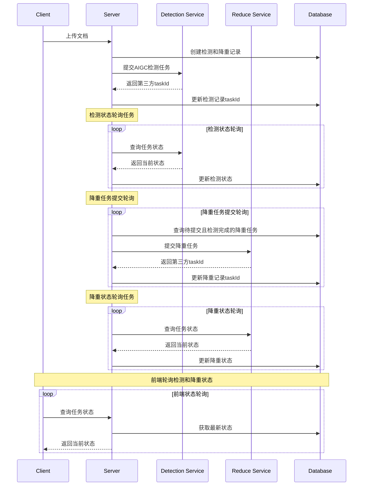

# AIGC文档降重模块后端设计文档

## 1. 系统架构

### 1.0 业务流程



### 1.0.1 业务规则

1. 文档降重前置条件

   - 必须先完成AIGC检测
   - 检测完成后降重任务自动提交
   - 检测结果作为降重输入

2. 状态流转规则

   ```typescript
   enum DetectionStatus {
     PENDING = 0,    // 待检测
     PROCESSING = 1, // 检测中
     COMPLETED = 2,  // 检测完成
     FAILED = -1     // 检测失败
   }
   
   enum ReduceStatus {
     WAITING = 0,    // 等待降重(检测未完成)
     PENDING = 1,    // 待降重(检测已完成)
     PROCESSING = 2, // 降重中
     COMPLETED = 3,  // 降重完成
     FAILED = -1     // 降重失败
   }
   ```

3. 任务关联规则

   - 降重任务必须关联检测任务ID
   - 检测任务完成前降重任务状态为WAITING
   - 检测任务失败时不允许提交降重
   - 检测任务完成后才能开始降重处理


### 1.1 技术栈

- Express + TypeScript
- PostgreSQL 数据存储
- Redis 缓存
- 华为云OBS 文件存储

### 1.2 代码结构

```plaintext
src/
├── config/
│   └── reduce.config.ts                // 降重服务配置
├── controllers/
│   └── reduce/
│       ├── reduce.controller.ts        // 降重相关接口
│       ├── parse.controller.ts         // 解析相关接口
│       └── upload.controller.ts        // 上传相关接口
├── dto/
│   └── reduce/
│       ├── reduce.dto.ts              // 降重相关DTO
│       ├── parse.dto.ts               // 解析相关DTO
│       └── upload.dto.ts              // 上传相关DTO
├── middlewares/
│   ├── auth.middleware.ts             // 认证中间件
│   └── file.middleware.ts             // 文件处理中间件
├── models/
│   └── reduce.model.ts                // 降重记录模型
├── repositories/
│   └── reduce.repository.ts           // 降重数据操作层
├── routes/
│   └── reduce.route.ts                // 路由定义
├── schemas/
│   └── reduce/
│       ├── reduce.schema.ts           // 降重参数校验
│       ├── parse.schema.ts            // 解析参数校验
│       └── upload.schema.ts           // 上传参数校验
├── services/
│   └── reduce/
│       ├── reduce.service.ts          // 降重业务服务
│       ├── parse.service.ts           // 解析业务服务
│       ├── scheduler.service.ts       // 定时任务服务
│       └── upload.service.ts          // 上传业务服务
├── types/
│   └── reduce/
│       ├── reduce.type.ts             // 降重相关类型
│       ├── parse.type.ts              // 解析相关类型
│       └── upload.type.ts             // 上传相关类型
└── utils/
    ├── obs.util.ts                    // OBS工具
    ├── parser.util.ts                 // 解析工具
    └── signature.util.ts              // 签名工具
```

## 2. 数据模型

### 2.1 AIGC检测记录表(t_aigc_detection) (已存在)

```sql
CREATE TABLE t_aigc_detection (
    f_id              VARCHAR(36)     PRIMARY KEY DEFAULT (UUID()),
    f_user_id         VARCHAR(36)     NOT NULL COMMENT '用户ID',
    f_title           VARCHAR(255)    NOT NULL COMMENT '文档标题',
    f_word_count      INT            NOT NULL COMMENT '字数',
    f_third_task_id   VARCHAR(36)     COMMENT '第三方检测任务ID',
    f_status          TINYINT        NOT NULL DEFAULT 0 COMMENT '状态:0-待提交,1-已提交,2-检测中,3-已完成,-1-失败',
    f_error_msg       VARCHAR(500)    COMMENT '错误信息',
    f_similarity      FLOAT          COMMENT 'AI生成概率',
    f_report_url      VARCHAR(500)    COMMENT '报告下载URL',
    f_source_file_url VARCHAR(500)    COMMENT '源文件URL',
    f_source_file_type VARCHAR(20)    COMMENT '源文件类型',
    f_retry_count     INT            DEFAULT 0 COMMENT '重试次数',
    f_create_time     TIMESTAMP      NOT NULL DEFAULT CURRENT_TIMESTAMP,
    f_update_time     TIMESTAMP      NOT NULL DEFAULT CURRENT_TIMESTAMP ON UPDATE CURRENT_TIMESTAMP,
    INDEX idx_user_id (f_user_id),
    INDEX idx_third_task_id (f_third_task_id),
    INDEX idx_status (f_status),
    INDEX idx_create_time (f_create_time)
) COMMENT 'AIGC检测记录表';
```

### 2.2 降重任务表(t_reduce_task)

```sql
CREATE TABLE t_reduce_task (
    f_id              VARCHAR(36)     PRIMARY KEY DEFAULT (UUID()),
    f_user_id         VARCHAR(36)     NOT NULL COMMENT '用户ID',
    f_title           VARCHAR(255)    NOT NULL COMMENT '文档标题',
    f_word_count      INT            NOT NULL COMMENT '字数',
    f_detection_id    VARCHAR(36)     NOT NULL COMMENT 'AIGC检测记录ID',
    f_third_task_id   VARCHAR(36)     COMMENT '第三方降重任务ID',
    f_recheck_id      VARCHAR(36)     COMMENT '降重后重新查重的任务ID，用于评估降重效果',
    f_status          TINYINT        NOT NULL DEFAULT 0 COMMENT '状态:0-待提交,1-已提交,2-降重中,3-已完成,-1-失败',
    f_error_msg       VARCHAR(500)    COMMENT '错误信息',
    f_reduce_url      VARCHAR(500)    COMMENT '降重文档URL',
    f_recheck_url     VARCHAR(500)    COMMENT '重查文档URL',
    f_reduce_rate     DECIMAL(5,2)   COMMENT '降重率',
    f_process_time    INT            COMMENT '处理耗时(秒)',
    f_retry_count     INT            DEFAULT 0 COMMENT '重试次数',
    f_create_time     TIMESTAMP      NOT NULL DEFAULT CURRENT_TIMESTAMP,
    f_update_time     TIMESTAMP      NOT NULL DEFAULT CURRENT_TIMESTAMP ON UPDATE CURRENT_TIMESTAMP,
    INDEX idx_user_id (f_user_id),
    INDEX idx_detection_id (f_detection_id),
    INDEX idx_third_task_id (f_third_task_id),
    INDEX idx_create_time (f_create_time),
    INDEX idx_status (f_status)
) COMMENT '降重任务表';
```

## 2.3 定时任务设计


### 2.3.1 降重任务提交定时任务

```typescript
// 每30秒执行一次
@Cron('*/30 * * * * *')
async submitReduceTasks() {
  try {
    // 查询检测已完成但未提交降重的任务
    const tasks = await this.reduceRepo.findUnsubmitted();
    
    for (const task of tasks) {
      // 验证检测状态
      const detection = await this.detectionRepo.findById(task.f_detection_id);
      if (detection.f_status !== DetectionStatus.COMPLETED) {
        continue;
      }
      
      // 提交降重任务
      const thirdTaskId = await this.thirdPartyService.submitReduce({
        taskId: detection.f_third_task_id,
        // ... 其他参数
      });
      
      // 更新任务状态
      await this.reduceRepo.updateSubmitted(task.f_id, thirdTaskId);
    }
  } catch (error) {
    this.logger.error('Submit reduce tasks failed', error);
  }
}
```

### 2.3.3 降重状态同步任务

```typescript
// 每30秒执行一次
@Cron('*/30 * * * * *')
async syncReduceStatus() {
  try {
    // 查询所有已提交但未完成的降重任务
    const tasks = await this.reduceRepo.findUnfinished();
    
    for (const task of tasks) {
      // 调用第三方接口查询状态
      const result = await this.thirdPartyService.queryReduceStatus(task.f_third_task_id);
      
      // 更新本地状态
      await this.reduceRepo.updateStatus(task.f_id, {
        status: result.state,
        reduceUrl: result.aigcReduceDoc,
        recheckUrl: result.checkReduceDoc
      });
    }
  } catch (error) {
    this.logger.error('Sync reduce status failed', error);
  }
}
```


## 3. 接口设计

### 3.1 文档降重接口

#### 3.1.1 提交降重任务

```typescript
POST /api/aigc-reduce/submit

Request:
{
  key: string;           // 平台key
  userId: number;        // 用户ID
  title: string;         // 标题
  wordCount: number;     // 字数
  taskId: string;        // AIGC检测任务ID
  originType: string;    // 来源类型
  recheckId?: string;    // 重查任务ID
  recheckEdition?: string; // 查重版本
  reduceRecheck?: boolean; // 是否重查
}

Response:
{
  code: number;
  msg: string;
  data: null;
  time: number;
}
```

#### 3.1.2 查询任务状态

```typescript
POST /api/aigc-reduce/query

Request:
{
  key: string;      // 平台key
  taskId: string;   // 任务ID
}

Response:
{
  code: number;
  msg: string;
  data: {
    taskId: string;
    recheckId: string;
    state: number;
    aigcReduceDoc: string;
    checkReduceDoc: string;
  }
}
```

#### 3.1.3 分页查询降重记录

```typescript
POST /api/aigc-reduce/list

Request:
{
  key: string;           // 平台key
  userId: string;        // 用户ID
  pageNum: number;       // 页码，从1开始
  pageSize: number;      // 每页条数
  startTime?: string;    // 开始时间，格式：YYYY-MM-DD HH:mm:ss
  endTime?: string;      // 结束时间，格式：YYYY-MM-DD HH:mm:ss
  status?: number;       // 降重状态：0-待处理,1-处理中,2-完成,-1-失败
}

Response:
{
  code: number;
  msg: string;
  data: {
    total: number;       // 总记录数
    pages: number;       // 总页数
    list: Array<{
      id: string;                // 降重任务ID
      title: string;             // 文档标题
      wordCount: number;         // 字数
      createTime: string;        // 创建时间
      // 检测相关
      detectionStatus: number;   // 检测状态
      detectionReport: string;   // 检测报告URL
      similarity: number;        // AI生成概率
      // 降重相关
      reduceStatus: number;      // 降重状态
      reduceUrl: string;         // 降重文档URL
      reduceRate: number;        // 降重率
      processTime: number;       // 处理耗时(秒)
      // 重查相关
      recheckId: string;         // 重查任务ID
      recheckUrl: string;        // 重查报告URL
      // 错误信息
      errorMsg: string;          // 错误信息
    }>;
  };
  time: number;
}
```

## 4. 第三方服务对接

注意：调用第三服务，请在header中添加参数"key=ODXE7G24"，"ODXE7G24"为配置值

### 4.1 文档降重服务

#### 4.1.1 服务信息

- 服务地址：https://test-gateway.laibokeji.com/lb-paper-api
- 接口清单：
  - 提交任务：/internal/aigc-reduce/submit
  - 查询任务：/internal/aigc-reduce/query
- 服务依赖：
  - AIGC检测服务
  - 文档处理服务
  - 文件存储服务

#### 4.1.2 降重流程

1. 文档预处理

   - 文件上传
     - 获取检测任务信息
       - 验证检测状态(必须为COMPLETED)
       - 获取检测报告内容
       - 提取需要降重的段落
     - 文档解析处理
       - 提取文本内容
       - 保存格式信息
       - 分段处理
     - 降重准备
       - 根据检测结果标记重点段落
       - 计算降重优先级
       - 准备降重参数

2. 提交降重

   - 任务参数配置

     - 必要参数：

       ```typescript
       {
         key: string;        // 平台key   ODXE7G24
         userId: number;     // 用户ID
         title: string;      // 文档标题
         wordCount: number;  // 文档字数
         taskId: string;     // AIGC检测任务ID(必须已完成检测)
         originType: 'CHECK' | 'DOC' | 'TEXT'; // 来源类型
       }
       ```

     - 可选参数：

       ```typescript
       {
         recheckId?: string;      // 重查任务ID
         recheckEdition?: string; // 查重版本
         reduceRecheck?: boolean; // 是否重查
       }
       ```

   - 任务提交流程

     1. 参数验证
     2. 用户权限检查
     3. 额度验证
     4. 创建降重任务
     5. 返回任务ID

   - 响应示例

     ```typescript
       {
         "code": 0,
         "msg": "操作成功",
         "data": null,
         "time": 1711420017905
       }
     ```

3. 状态轮询

   - 轮询策略

     - 初始间隔：3秒
     - 最大间隔：30秒
     - 退避算法：指数退避
     - 最大重试：20次

   - 状态定义

     ```typescript
     enum ReduceTaskStatus {
       PENDING = 0,    // 待处理
       PROCESSING = 1, // 处理中
       COMPLETED = 2,  // 完成
       FAILED = -1     // 失败
     }
     ```

   - 状态流转

     1. PENDING -> PROCESSING：开始处理
     2. PROCESSING -> COMPLETED：处理完成
     3. PROCESSING -> FAILED：处理失败

   - 超时处理

     - 任务超时时间：30分钟
     - 超时自动标记失败
     - 触发告警通知

   - 调用示例

     ```typescript
        curl --location --request POST 'https://test.gateway.laibokeji.com/lb-paper-api/internal/aigc-reduce/query' \
        --header 'key: E370ZCUR' \
        --header 'Content-Type: application/json' \
        --data '{
          "taskId": "708ef79628c5464b94bd87240b0d1a4d"
        }'
     ```

  - 响应示例

    ```typescript
      {
          "code": 0,
          "msg": "操作成功",
          "data": {
              "aigcReduceDoc": "https://similar-center.obs.cn-east-3.myhuaweicloud.com/aigc-reduce-word/708ef79628c5464b94bd87240b0d1a4d.doc?AccessKeyId=CX3MHIRMLG1NKFSBOLTT&Expires=1732869844&Signature=65SCgCHJO%2B1FcP7DbKyKUuD6Eac%3D",
              "checkReduceDoc": "https://base-service-reduce.oss-cn-hangzhou.aliyuncs.com/reduce-word/708ef79628c5464b94bd87240b0d1a4d-1.doc?Expires=1732955645&OSSAccessKeyId=LTAI4GG6WyHWJuwdkXLhDvgb&Signature=V19ZGtzi92jsP%2BEvEiAhxBbT114%3D",
              "state": 2,
              "taskId": "708ef79628c5464b94bd87240b0d1a4d",
              "recheckId": "708ef79628c5464b94bd87240b0d1a4d-1"
          },
          "time": 1732869244923
      }
    ```

4. 结果处理
   - 成功处理流程
     1. 获取降重文档
        - 生成文档下载URL
        - URL有效期：24小时
        - 访问权限控制
     2. 重查处理（如果开启）
        - 提交重查任务
        - 等待重查完成
        - 获取重查报告
     3. 更新任务状态
        - 记录处理结果
        - 更新用户额度
        - 生成操作日志
   - 失败处理流程
     1. 错误分类
        - 系统错误：自动重试
        - 业务错误：返回错误信息
        - 资源错误：触发告警
     2. 失败处理
        - 记录错误日志
        - 释放资源
        - 恢复用户额度
     3. 重试机制
        - 最大重试次数：3次
        - 重试间隔：5秒
        - 重试条件判断

#### 4.2.3 异常处理

1. 任务提交异常
   - 网络超时：自动重试
   - 参数错误：返回具体错误信息
   - 服务不可用：切换备用服务

2. 状态查询异常
   - 查询超时：继续轮询
   - 状态异常：触发人工介入
   - 结果获取失败：重新获取

3. 文档处理异常
   - 格式错误：返回格式要求
   - 大小超限：分片处理
   - 内容错误：提示具体原因

## 5. 监控告警

### 5.1 监控指标

- API响应时间
- 错误率统计
- 资源使用率
- 并发处理能力
- 任务成功率
- 平均处理时间

### 5.2 告警规则

- 任务失败率超30%
- 处理时间超1分钟
- 系统错误率超5%