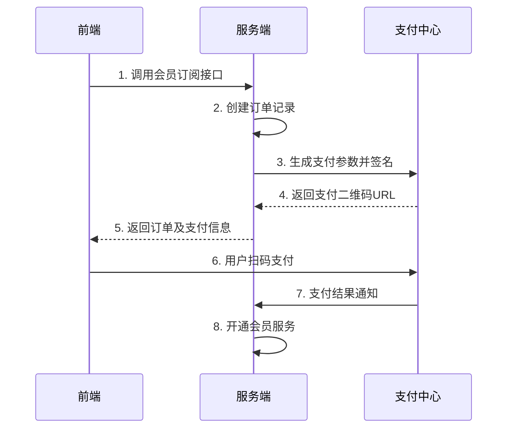

# 会员支付流程详细设计文档

## 1. 服务概述

### 1.1 功能描述

会员支付服务是一个集成了会员订阅和支付功能的核心业务模块，主要负责处理用户的会员计划订阅、支付处理、订单管理等功能。该服务与第三方支付平台对接，提供安全、可靠的支付流程。

### 1.2 业务流程



## 2. 支付服务实现

### 2.1 支付配置

```typescript
// src/config/payment.config.ts
export const paymentConfig = {
  // 支付网关配置
  gateway: {
    url: process.env.PAY_GATEWAY_URL || 'https://gateway-cq-ai.laibokeji.com/ai-detector-write/external/aigc',
    appId: process.env.PAY_APP_ID,
    appSecret: process.env.PAY_APP_SECRET,
    notifyUrl: `${process.env.API_BASE_URL}/api/payments/notify`
  },
  
  // 订单配置
  order: {
    expireTime: 1800,  // 订单过期时间(秒)
    retryTimes: 3,     // 重试次数
    retryDelay: 1000   // 重试间隔(毫秒)
  },
  
  // 缓存配置
  cache: {
    orderPrefix: 'order:',
    paymentPrefix: 'payment:',
    expireTime: 1800
  }
};
```

### 2.2 支付服务实现

```typescript
// src/services/payment/payment.service.ts
export class PaymentService {
  private httpClient;
  private paymentCache = new PaymentCache();
  private orderCache = new OrderCache();

  constructor() {
    this.httpClient = createHttpClient(paymentConfig.gateway.url);
  }

  async createPayment(params: PaymentRequest): Promise<PaymentResponse> {
    try {
      // 1. 构建支付参数
      const payParams = {
        order_id: params.orderNo,
        appid: paymentConfig.gateway.appId,
        product_name: params.subject,
        product_desc: params.body,
        pay_amount: params.amount,
        callback: paymentConfig.gateway.notifyUrl
      };

      // 2. 生成签名
      const sign = SignatureUtil.generate(payParams, paymentConfig.gateway.appSecret);

      // 3. 请求支付网关
      const response = await this.httpClient.post('', {
        ...payParams,
        sign
      });

      // 4. 处理响应
      if (!response.data.code_url) {
        throw new Error('Failed to get payment URL');
      }

      const result = {
        payUrl: response.data.code_url,
        qrCode: response.data.code_url,
        orderId: params.orderId,
        orderNo: params.orderNo,
        amount: params.amount,
        expireTime: new Date(Date.now() + paymentConfig.order.expireTime * 1000).toISOString()
      };

      // 5. 缓存订单信息
      await this.orderCache.cacheOrder({
        ...params,
        payUrl: result.payUrl,
        expireTime: result.expireTime
      });

      return result;
    } catch (error) {
      logger.error('Create payment failed:', error);
      throw error;
    }
  }

  async handleCallback(params: PaymentCallback): Promise<PaymentResult> {
    try {
      // 1. 验证签名
      const isValid = SignatureUtil.verify(
        params,
        params.sign,
        paymentConfig.gateway.appSecret
      );

      if (!isValid) {
        throw new Error('Invalid signature');
      }

      // 2. 处理支付结果
      const result = {
        success: params.trade_status === 'SUCCESS',
        orderId: params.order_id,
        tradeNo: params.trade_no,
        errorMessage: params.trade_status === 'SUCCESS' ? undefined : '支付失败'
      };

      // 3. 缓存支付结果
      await this.paymentCache.cachePaymentResult(params.order_id, result);

      return result;
    } catch (error) {
      logger.error('Handle payment callback failed:', error);
      throw error;
    }
  }

  async getPaymentStatus(orderNo: string): Promise<PaymentStatus> {
    try {
      // 1. 检查缓存的支付结果
      const cachedResult = await this.paymentCache.getPaymentResult(orderNo);
      if (cachedResult) {
        return {
          status: cachedResult.success ? 'SUCCESS' : 'FAILED',
          orderNo,
          message: cachedResult.errorMessage
        };
      }

      // 2. 查询订单状态
      const order = await this.orderCache.getOrder(orderNo);
      if (!order) {
        throw new Error('Order not found');
      }

      // 3. 检查是否过期
      if (new Date(order.expireTime) < new Date()) {
        return {
          status: 'EXPIRED',
          orderNo,
          message: 'Payment URL expired'
        };
      }

      return {
        status: 'PENDING',
        orderNo
      };
    } catch (error) {
      logger.error('Get payment status failed:', error);
      throw error;
    }
  }

  async refreshPaymentUrl(orderId: string): Promise<PaymentResponse> {
    try {
      // 1. 获取订单信息
      const order = await this.orderCache.getOrder(orderId);
      if (!order) {
        throw new Error('Order not found');
      }

      // 2. 重新创建支付链接
      return await this.createPayment(order);
    } catch (error) {
      logger.error('Refresh payment URL failed:', error);
      throw error;
    }
  }
}
```

### 2.3 支付工具类

```typescript
// src/utils/payment/signature.util.ts
export class SignatureUtil {
  static generate(params: Record<string, any>, secret: string): string {
    // 1. 过滤空值
    const filteredParams = Object.entries(params)
      .filter(([_, value]) => value !== null && value !== undefined)
      .reduce((acc, [key, value]) => ({
        ...acc,
        [key]: value
      }), {});

    // 2. 按键排序
    const sortedKeys = Object.keys(filteredParams).sort();

    // 3. 构建签名字符串
    const signStr = sortedKeys
      .map(key => `${key}=${filteredParams[key]}`)
      .join('&') + `&key=${secret}`;

    // 4. MD5加密
    return crypto
      .createHash('md5')
      .update(signStr)
      .digest('hex')
      .toUpperCase();
  }

  static verify(params: Record<string, any>, sign: string, secret: string): boolean {
    const { sign: _, ...rest } = params;
    const calculatedSign = this.generate(rest, secret);
    return calculatedSign === sign;
  }
}
```

## 3. 支付状态管理

### 3.1 状态轮询

```typescript
// frontend/src/hooks/usePaymentStatus.ts
export const usePaymentStatus = (orderNo: string) => {
  const [status, setStatus] = useState<PaymentStatus | null>(null);
  const [loading, setLoading] = useState(true);

  useEffect(() => {
    let timer: NodeJS.Timeout;
    const checkStatus = async () => {
      try {
        const response = await axios.get(`/api/payments/${orderNo}/status`);
        setStatus(response.data);
        
        if (response.data.status === 'SUCCESS' || response.data.status === 'FAILED') {
          clearInterval(timer);
        }
      } catch (error) {
        console.error('Check payment status failed:', error);
      } finally {
        setLoading(false);
      }
    };

    timer = setInterval(checkStatus, 3000); // 每3秒查询一次
    return () => clearInterval(timer);
  }, [orderNo]);

  return { status, loading };
};
```

### 3.2 支付链接刷新

```typescript
// frontend/src/hooks/usePaymentUrl.ts
export const usePaymentUrl = (orderId: string) => {
  const [payUrl, setPayUrl] = useState<string | null>(null);
  const [refreshing, setRefreshing] = useState(false);

  const refresh = async () => {
    try {
      setRefreshing(true);
      const response = await axios.post(`/api/payments/${orderId}/refresh`);
      setPayUrl(response.data.payUrl);
    } catch (error) {
      console.error('Refresh payment URL failed:', error);
    } finally {
      setRefreshing(false);
    }
  };

  return { payUrl, refreshing, refresh };
};
```

### 3.3 支付结果通知

```typescript
// frontend/src/events/payment.events.ts
export const paymentEvents = new EventEmitter();

// frontend/src/components/PaymentListener.tsx
export const PaymentListener: React.FC = () => {
  useEffect(() => {
    const handlePaymentSuccess = (orderId: string) => {
      message.success('支付成功');
      // 刷新会员状态
      refreshMemberStatus();
    };

    paymentEvents.on('paymentSuccess', handlePaymentSuccess);
    return () => {
      paymentEvents.off('paymentSuccess', handlePaymentSuccess);
    };
  }, []);

  return null;
};
```

## 5. 安全设计

### 5.1 签名机制

- 所有支付请求必须包含签名
- 签名参数按字典序排序
- 使用MD5进行签名加密
- 验证所有支付回调的签名

### 5.2 参数校验

- 验证订单金额
- 验证订单状态
- 验证支付超时
- 防重放攻击

### 5.3 并发控制

- 使用分布式锁控制订单创建
- 保证支付回调幂等性
- 事务控制确保数据一致性

## 6. 部署配置

### 6.1 环境变量

```bash
# 支付配置
PAY_GATEWAY_URL= https://tunionpay.paperyy.com/pay/view/qrcode
PAY_APP_ID=1072
PAY_APP_SECRET=zprZ7A66rskxZZEA7Wr6dN4Wsj6M4GNC
PAY_NOTIFY_URL={API_BASE_URL}/payments/notify

# 系统配置
NODE_ENV=production
API_BASE_URL=https://api.example.com
PAYMENT_LOG_LEVEL=info
```

### 6.2 性能优化

- 使用Redis缓存订单信息
- 异步处理支付回调
- 数据库索引优化
- 读写分离